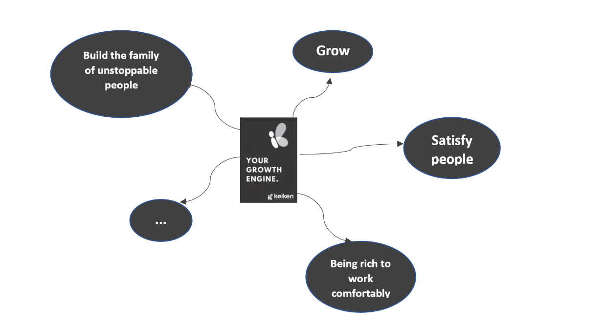
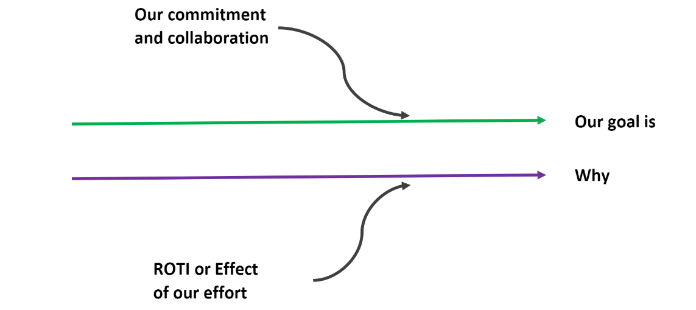
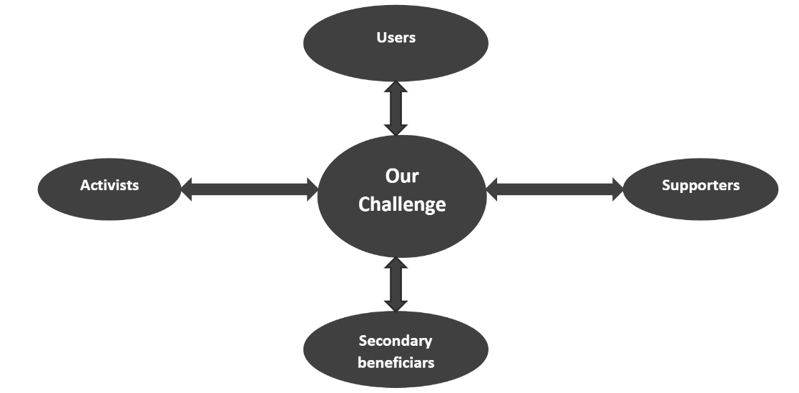
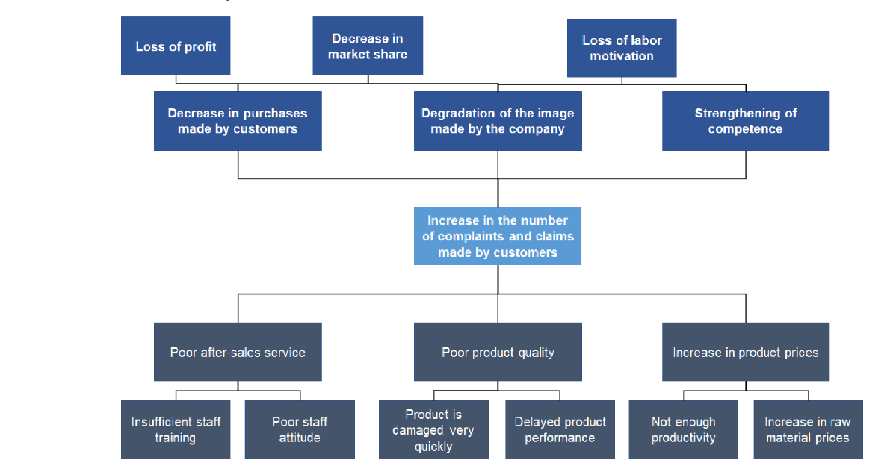

Design Thinking 

Design thinking is a creative method developed at Stanford University to solve problems that helps us take certain steps to reach new effective solutions that improve the way we work, our view of things and the way we interact with others. 

Design thinking depends on a set of steps that can be summarized in five or six steps that we will present in the following, and we point out here that these steps are not a global standard that must be followed, but they are effective for most people and easy for them to deal with, because not every manager, for example, is creative. Therefore, practical steps must be developed for everyone, while creative people can create their own design that effectively addresses problems. 

🧠Create Persona 

Design thinking is a bit like a food recipe. If you want to cook in a way that the connoisseur will like, you must follow some recommendations. The first recommendation in the design thinking process is self-understanding and passion, which are necessary to launch projects, face challenges, and be able to understand and persuade others. What is the GOAL & INTERESTS! 

😇 Empathy 

It is important to know the people whose problems we are going to work on. We must also know the challenges that these people face and look at the problem from the same angle from which they see it. We must know what their deep feelings are and what they suffer from exactly. Here we must be careful not to confuse sympathy with pity. Empathy is to put ourselves in the place of the other and feel what he feels. As for compassion, it is to regret the situation of the other without understanding the depth of the problem and what the person feels. 

We should also think about if we faced the same problem, what are the solutions we might think of, what are the right ways to follow, what are the things we would avoid doing, and what are the things that we might have overlooked. 

We must know all stakeholders in the project and how they interact and affect each others, in this way we can meet them to claim the maximum of the information that will give us a clear vision to design our solution. 

Now, to reach stakeholders we can use several methods as for example: 

-   Interview each department (stakeholder) and try to catch information from them. 
    
-   launching a poll can help reach a wide audience. 
    

-   Observing the workflow and taking notes. 
    
-   I would love that you share other methods with me, dear reader. 
    

🎯 Define the challenge 

We must determine the problem by looking at the effects of this problem and understanding the causes that generate this problem, then detect the cause that contributes to the majority of the effects, and we design our model to solve it. Of course if it is a small problem we can attack all the causes, but in complex systems it becomes more complicated to attack the whole problem. 

🧠Create solution 

-   Brainstorming. 
    
-   Decide and choose one solution. 
    
-   Focus on the solution. 
    
-   Define the life cycle of the solution. 
    

🗞 Prototyping 

It is a step that saves us a lot of effort and resources. It is a simple initial idea or a simplified model for an innovative solution. 

-   The model can be tangible, for example, if we specialize in the car industry, the model can be a stereoscopic model that resembles our car, or a 3D design program that simulates the car... 
    
-   A prototype can be a story that simplifies all the stages a product goes through in creation and how it is used when it is passed in delivery (reason behind being good storytellers). 
    
-   A prototype can also be an experiment, where we allow the customer to try our product, such as a web application. 
    

📈Review, Optimization 

-   Present the solution to the people involved. 
    
-   Listen first, because we want the client to give us feedback. 
    
-   We do not try to convince the client of what we have achieved because we aspire to get cash for product development. 
    
-   We must make the people involved in the project, feel the importance of the opinions they provide and the importance of their participation in all phases of the project. 
    

-   We must avoid getting emotional about a solution that has taken a huge investment from us (staying neutral and accepting criticism).