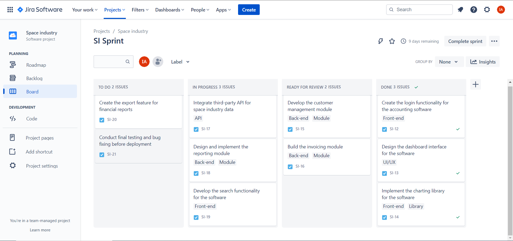

# 🔗 Context

As an Agile team, the first thing to do is to define the project goals, features, and requirements in collaboration with the accounting team, CEO, and legal team. Space industry-specific accounting software may require unique features and workflows, so it is important to involve the Space engineers in the process to ensure that the software aligns with their needs.

The team should also identify any dependencies and external services required for the software development process. For example, if a third-party software provider offers a needed service as an API, the team should ensure that they have access to the API and that it is integrated properly with the software.

As for the Agile roles, the team should have a Product Owner who will represent the stakeholders and be responsible for prioritizing and managing the product backlog. A Scrum Master will be responsible for facilitating the Agile process and ensuring that the team adheres to Agile principles and practices. The development team should consist of skilled developers who are experienced in building complex software systems.

Since the project has a limited budget, the Agile team will need to prioritize features and deliverables based on their importance and value to the stakeholders. They will need to work closely with the accounting team and other stakeholders to ensure that the software meets their needs while staying within budget.

Given that an existing application is currently being used, the Agile team should plan for a smooth transition process that minimizes disruption to the users. They should also ensure that the new software is compliant with IFRS regulations to avoid potential fines.

Throughout the development process, the Agile team should use iterative development and continuous feedback to ensure that the software is meeting the needs of the stakeholders. They should also be prepared to make adjustments and changes as needed based on feedback and changing requirements.

Overall, developing a Space industry-specific accounting software using Agile methodologies requires a collaborative effort between the Agile team, the accounting team, the CEO, the legal team, and the Space engineers. The team will need to prioritize features based on value, stay within budget, ensure compliance with regulations, and provide a smooth transition process for users.

## 📝  What will be a typical Sprint Activities for these teams : A Regular Day, with all the rituals + The special days of the spring ?

A regular day in the Sprint would involve the team participating in the following Agile rituals:

1.  Daily Stand-up: Brief daily check-ins to discuss progress and any issues or blockers that need attention.
    
2.  Sprint Planning: Discuss and prioritize the backlog items for the upcoming sprint, and plan out the sprint goals and tasks.
    
3.  Sprint Review: Evaluate the progress made during the sprint, demonstrate any completed work, and discuss areas for improvement.
    
4.  Sprint Retrospective: Reflect on the sprint and identify what went well, what didn't, and how to improve for the next sprint.
    

In addition to these regular Agile rituals, the team may also have special days during the Sprint that require additional activities. For example, if there is a major release coming up, the team may need to spend extra time testing and ensuring that the software is ready for release. They may also need to work with the accounting team to ensure that the reports generated by the software are compliant with IFRS regulations.

The team may also need to collaborate with the Space engineers to ensure that the software aligns with their needs and requirements. This may involve additional planning and design sessions to ensure that the software is meeting the needs of all stakeholders.

## 📝  What will be the different roles needed in this team? how big should it be?

To develop a Space industry-specific accounting software using Agile methodologies, the team would require several key roles. The roles required will depend on the size and complexity of the project. However, some typical roles that could be required are:

1.  Product Owner: responsible for defining the product vision, prioritizing the product backlog, and ensuring that the team delivers value to the users and stakeholders.
    
2.  Scrum Master: responsible for facilitating the team’s agile processes, removing impediments, and helping the team to continuously improve.
    
3.  Business Analyst: responsible for eliciting and documenting business requirements, analyzing and refining those requirements, and ensuring that they are properly reflected in the product backlog.
    
4.  UX/UI Designer: responsible for designing the user experience and user interface of the product, working closely with the business analyst and the development team to ensure that the design is both user-friendly and technically feasible.
    
5.  Technical Architect: responsible for defining the technical architecture of the product, ensuring that it is scalable, maintainable, and aligned with the company’s overall technology strategy.
    
6.  Front-end Developer: responsible for implementing the user interface of the product, working closely with the UX/UI designer to ensure that the design is properly implemented and optimized for performance.
    
7.  Back-end Developer: responsible for implementing the server-side logic of the product, working closely with the technical architect to ensure that the design is properly implemented and optimized for performance.
    
8.  Quality Assurance Engineer: responsible for testing the product, ensuring that it meets the acceptance criteria and quality standards, and working closely with the development team to resolve any issues.
    
9.  DevOps Engineer: responsible for automating the deployment and delivery of the product, working closely with the development team to ensure that the product is properly deployed and maintained.

## 📝  Imagine their backlog: 10 fake Tasks (Large enough to be handled by different roles : Funcitonal Design, UI Design, Technical DEsign, Front End Dev, Service Dev, Test, Deployement) linked to building this accounting app for space industry, and try to Fill all the elements of on of these task ? what will compose this task? will it have subtasks? will the subtasks hav subtasks themselves?

Let's imagine that the product backlog consists of these tasks:

- *Task 1: Create the login functionality for the accounting software*
- *Task 2: Design the dashboard interface for the software*
- *Task 3: Implement the charting library for the software*
- *Task 4: Develop the customer management module*
- *Task 5: Build the invoicing module*
- *Task 6: Integrate third-party API for space industry data*
- Task 7: Design and implement the reporting module
- *Task 8: Develop the search functionality for the software*
- *Task 9: Create the export feature for financial reports*
- *Task 10: Conduct final testing and bug fixing before deployment*

And let's take the first task `Create the login functionality for the accounting software*` to see how the scrum team collaborate and defferent subtasks to complete this functionality:

-   Functional design: Identify the features and requirements needed for the login functionality, create user stories and acceptance criteria.
-   Technical design: Determine the technical specifications and architecture needed for the login functionality.
-   UI design: Create the login screen design and user interface.
-   Frontend development: Develop the login screen and user interface using appropriate technologies.
-   Backend development: Implement the necessary backend functionality to support the login feature.
-   Testing: Perform unit testing and functional testing to ensure that the login feature is working as intended.
-   Deployment: Deploy the login feature to the test environment for further testing and review.

>This task may have additional sub-tasks, such as creating error handling for invalid login attempts, implementing password reset functionality, and integrating the login feature with other parts of the application.

## 📝  How can the team follow their progress ?

The team can track their progress through daily stand-ups, sprint planning meetings, and sprint reviews. They can use a project management tool such as Jira to monitor the status of individual tasks and the overall progress of the project.
    
## 📝  How can the team share about their problems and blocking challenges ?

The team can share problems and blockers during daily stand-ups or by creating a dedicated Discord or Slack channel for team communication. The Scrum Master can also hold one-on-one meetings with team members to discuss any issues in more detail.
    
## 📝  How can the team plan the first deployment ?

The team can plan the first deployment by identifying the requirements for the production environment, creating a deployment plan, and conducting thorough testing in the staging environment. The deployment engineer will be responsible for overseeing the actual deployment process and ensuring that it goes smoothly.

## 📝  Create a Jira project with the 10 tickets that you thought about, and adapt the ticket workflow to the process you imagined for the team

>Task 1: Create the login functionality for the accounting software 
>Description: Users should be able to log in to the accounting software using their username and password. 
>Assignee: Front-end Developer 
>Labels: Login, Authentication, Front-end 
>Due Date: 2 week from sprint start date

>Task 2: Design the dashboard interface for the software 
>Description: Create a user-friendly dashboard interface that displays key financial metrics and performance indicators. 
>Assignee: UX/UI Designer 
>Labels: Dashboard, UI/UX, Design 
>Due Date: 1 weeks from sprint start date

>Task 3: Implement the charting library for the software 
>Description: Integrate a charting library to display financial data in a visually appealing and easy-to-understand format. 
>Assignee: Front-end Developer 
>Labels: Charting, Library, Front-end 
>Due Date: 3 weeks from sprint start date

>Task 4: Develop the customer management module 
>Description: Implement a module that allows users to manage customer information, including contact details, payment terms, and credit limits. 
>Assignee: Back-end Developer 
>Labels: Customer Management, Back-end, Module 
>Due Date: 3 weeks from sprint start date

>Task 5: Build the invoicing module 
>Description: Implement a module that allows users to generate and send invoices to customers, track payment status, and manage outstanding invoices. 
>Assignee: Back-end Developer 
>Labels: Invoicing, Back-end, Module 
>Due Date: 3 weeks from sprint start date

>Task 6: Integrate third-party API for space industry data 
>Description: Integrate a third-party API to provide relevant space industry data for financial analysis and reporting. 
>Assignee: Technical Architect 
>Labels: API Integration, Technical Architecture 
>Due Date: 3 weeks from sprint start date

>Task 7: Design and implement the reporting module 
>Description: Implement a module that generates financial reports based on user-selected parameters, including balance sheets, income statements, and cash flow statements. 
>Assignee: Back-end Developer 
>Labels: Reporting, Back-end, Module 
>Due Date: 3 weeks from sprint start date

>Task 8: Develop the search functionality for the software 
>Description: Implement a search feature that allows users to search for transactions, invoices, and other financial information. 
>Assignee: Front-end Developer 
>Labels: Search, Front-end, Functionality 
>Due Date: 3 weeks from sprint start date

>Task 9: Create the export feature for financial reports 
>Description: Implement a feature that allows users to export financial reports in various file formats, including CSV and Excel. 
>Assignee: Front-end Developer 
>Labels: Export, Front-end, Feature 
>Due Date: 4 weeks from sprint start date

>Task 10: Conduct final testing and bug fixing before deployment 
>Description: Perform comprehensive testing and bug fixing to ensure that the software is stable and meets all requirements before deployment. 
>Assignee: Quality Assurance Engineer 
>Labels: Testing, Quality Assurance, Deployment 
>Due Date: 4 weeks from sprint start date

 

