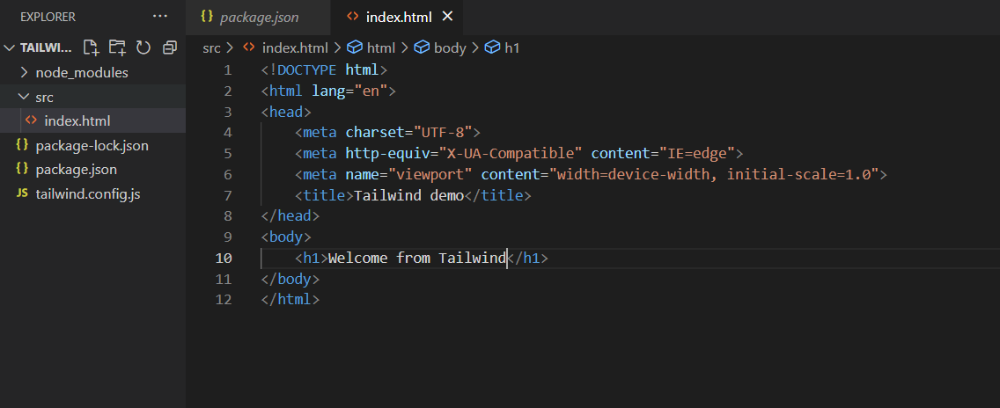
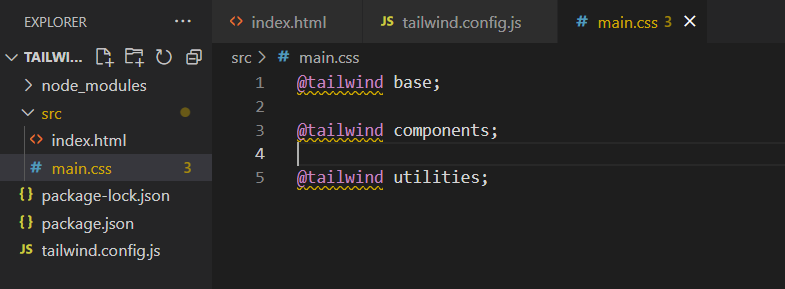
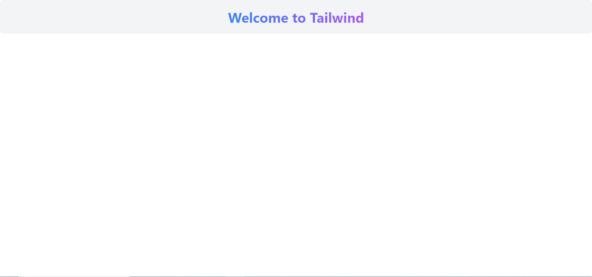
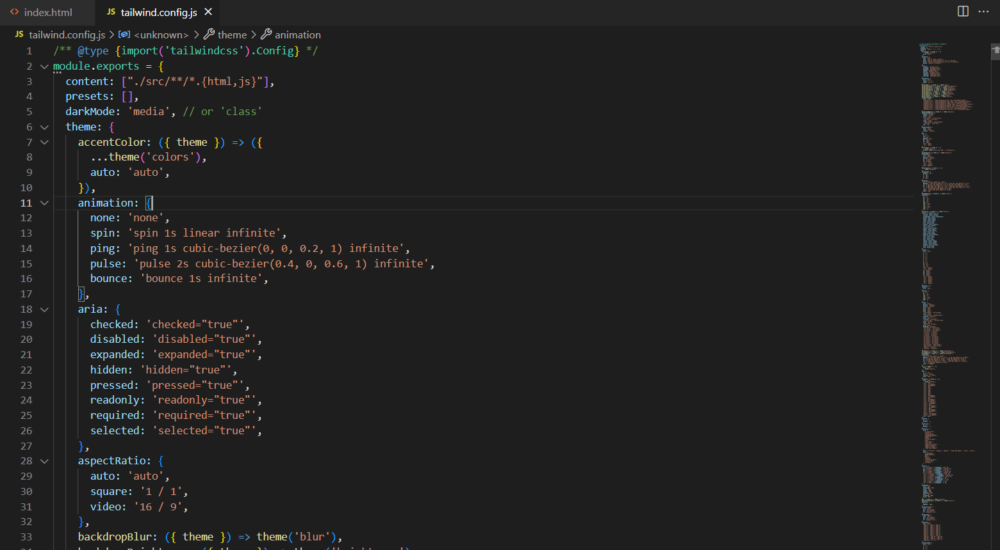

## What is Tailwind ?

Tailwind CSS is a utility-first CSS framework, which means it is designed to provide a set of pre-defined CSS classes that can be used to quickly style HTML elements without having to write custom CSS. This approach enables developers to create responsive and customizable user interfaces without having to spend too much time on writing and maintaining CSS code.

The architecture of Tailwind CSS is based on the concept of a "utility class", which is a pre-defined CSS class that applies a specific style or set of styles to an HTML element. These classes are designed to be used in combination to create more complex styles, without having to write any custom CSS code.

Tailwind CSS includes a large number of pre-defined utility classes that cover a wide range of styling needs, such as typography, layout, color, and more. These classes are organized into categories based on their functionality, which makes it easier to find the right class for the job.

To use Tailwind CSS, you include the framework's CSS file in your HTML document, and then add the appropriate utility classes to your HTML elements. For example, to add padding to an element, you can use the "p" class followed by a number to specify the amount of padding, such as "p-4" for 4 units of padding.

## Installation via npm

Install `tailwindcss` via npm, and create your `tailwind.config.js` file.
```node
npm install -D tailwindcss // To install node_modules for tailwind
npx tailwindcss init // To create the configuration file tailwind.config.js
```

Then let's add the src package for our code:




## Configure your template paths

Add the paths to all of your template files in your `tailwind.config.js` file.
```node
/** @type {import('tailwindcss').Config} */
module.exports = {
  content: ["./src/**/*.{html,js}"],
  theme: {
    extend: {},
  },
  plugins: [],
}
```

## Add the Tailwind directives to your CSS

Add the `@tailwind` directives for each of Tailwind’s layers to your main CSS file.
```css
@tailwind base;
@tailwind components;
@tailwind utilities;
```



In a Tailwind CSS project, the directives `@tailwind base`, `@tailwind components`, and `@tailwind utilities` are used in the main CSS file to include the pre-designed styles from Tailwind and generate the final styles for your project.

Here's what each directive does:

1.  `@tailwind base`: This directive includes the base styles for your project, such as typography and box-sizing rules. It sets the foundation for all the other styles in your project.
    
2.  `@tailwind components`: This directive includes pre-designed components, such as buttons, forms, and cards. It provides a set of reusable styles that can be used throughout your project.
    
3.  `@tailwind utilities`: This directive includes the utility classes that allow you to quickly style your HTML elements. These utility classes are designed to be composable and allow you to create complex layouts and styles without writing custom CSS.
    

By using these three directives in your main CSS file, you can easily include and customize the styles from Tailwind in your project. When you run the Tailwind CLI to generate the final CSS file, it will take into account all the styles included in these directives and output the final optimized styles that you can use in your project.

## Start the Tailwind CLI build process

Run the CLI tool to scan your template files for classes and build your CSS.
```node
npx tailwindcss -i ./src/input.css -o ./dist/output.css --watch
```

Once the build of your css file finish, you get an output file kinda:
```css
/*

! tailwindcss v3.2.7 | MIT License | https://tailwindcss.com

*/

  

/*

1. Prevent padding and border from affecting element width. (https://github.com/mozdevs/cssremedy/issues/4)

2. Allow adding a border to an element by just adding a border-width. (https://github.com/tailwindcss/tailwindcss/pull/116)

*/

  

*,

::before,

::after {

  box-sizing: border-box;

  /* 1 */

  border-width: 0;

  /* 2 */

  border-style: solid;

  /* 2 */

  border-color: #e5e7eb;

  /* 2 */

}

  

::before,

::after {

  --tw-content: '';

}

  

/*

1. Use a consistent sensible line-height in all browsers.

2. Prevent adjustments of font size after orientation changes in iOS.

3. Use a more readable tab size.

4. Use the user's configured `sans` font-family by default.

5. Use the user's configured `sans` font-feature-settings by default.

*/

  

html {

  line-height: 1.5;

  /* 1 */

  -webkit-text-size-adjust: 100%;

  /* 2 */

  -moz-tab-size: 4;

  /* 3 */

  -o-tab-size: 4;

     tab-size: 4;

  /* 3 */

  font-family: ui-sans-serif, system-ui, -apple-system, BlinkMacSystemFont, "Segoe UI", Roboto, "Helvetica Neue", Arial, "Noto Sans", sans-serif, "Apple Color Emoji", "Segoe UI Emoji", "Segoe UI Symbol", "Noto Color Emoji";

  /* 4 */

  font-feature-settings: normal;

  /* 5 */

}
```

Now, we're ready to get started with tailwind styling...

## Start using Tailwind in your HTML

Add your compiled CSS file to the `<head>` and start using Tailwind’s utility classes to style your content.
```html
<!DOCTYPE html>

<html lang="en">

<head>

    <meta charset="UTF-8">

    <meta http-equiv="X-UA-Compatible" content="IE=edge">

    <meta name="viewport" content="width=device-width, initial-scale=1.0">

    <link href="/dist/output.css" rel="stylesheet">

    <title>Tailwind demo</title>

</head>

<body>

    <div class="bg-gray-100 rounded-lg p-6 flex justify-center">

        <h1 class="text-4xl font-bold text-center bg-clip-text text-transparent bg-gradient-to-r from-blue-500 to-purple-500">

          Welcome to Tailwind

        </h1>

      </div>      

</body>

</html>
```



Checkout my simple restaurant responsive page:
🔗 Source code: https://github.com/ismail-abdelouahab-git/simple-taillwind-app

Here is a demo of the page, is it delicious  ? 😋
If no preview is available, please check it here https://github.com/ismail-abdelouahab-git/Keiken-Piscine-Journey/blob/main/Week%206/Day%202/Tailwind%20CSS/tailwind-4.mp4


## What are limits of tailwind ?

While Tailwind CSS offers many benefits and is a popular choice for many developers, there are also some limitations to keep in mind:

1.  Learning curve: While Tailwind CSS offers many pre-defined classes that can be used to quickly style HTML elements, it also has a learning curve associated with it. Developers need to learn the naming conventions and class combinations, which can be overwhelming for those new to the framework.
    
2.  Large CSS file size: Because Tailwind CSS includes a large number of pre-defined classes, the CSS file size can be quite large. This can slow down page load times, especially on slower internet connections or devices.
    
3.  Limited design flexibility: While Tailwind CSS offers a wide range of pre-defined styles, it can be limiting in terms of design flexibility. It can be difficult to create unique and custom designs using only the pre-defined classes without writing additional custom CSS.
    
4.  Not ideal for small projects: Tailwind CSS is designed for larger projects that require a `consistent design system`. For smaller projects, it may be overkill and lead to unnecessary complexity.
    
5.  Potential for code bloat: While Tailwind CSS can be a time-saver, it is important to avoid the temptation to use too many utility classes. This can lead to code bloat, making the code harder to read, maintain, and debug.

## Customization

There is two ways to customize your style css :

**Overwriting**

To customize Tailwind CSS, you can overwrite the default values of its utility classes in `tailwind.config.js`. This file allows you to customize the color palette, font sizes, spacing, breakpoints, and other configuration options of the framework. By doing so, you can create a custom set of utility classes that match the design and style of your project.
You can directly change values of classes in the tailwind.config file simply by doing the following:
```node
npx tailwindcss init --full // to load all values and be able to change them, 
```



And, then re-build your styles:
```node
npx tailwindcss -i ./src/input.css -o ./dist/styles.css --watch
```
However this approach is not recommanded, you risk modifying some styles that you need in other areas of the code, so even if you don't use them, you might want to keep them in reserve. Let's see a quite method to customize confidently you css ...

**Extension**

Extending the default Tailwind CSS configuration is generally preferred over overwriting it in `tailwind.config.js`. This approach allows you to keep the existing styles and only add or modify the styles that you need for your project, without the risk of accidentally removing or breaking any existing styles.

To extend the default configuration, you can use the `extend` key in `tailwind.config.js`. This key allows you to add new styles or modify existing styles without completely overwriting them. Here's an example of how you can extend the default configuration to add a new color to the color palette, new font, and new screen size:
```javascript
/** @type {import('tailwindcss').Config} */

module.exports = {

  content: ["./src/**/*.{html,js}"],

  theme: {

    extend: {

      gradientColorStops: { // Add new gradient color

        'primary': '#00d4ff',

      'secondary': '#090979',

      },

      fontFamily: {

        'geo': ['Georgia'], // Add a new font family

      },

      screens: {

        '3xl': '1536px', // Add a new screen size for extra large screens

      },

      },

  },

  plugins: [

    require('tailwindcss'),

  ],

}
```

And we use these classes in our html as follows:
For example if we want to apply the font Georgia, we write "font" + "-" +"className" as mentioned in the following markup:
```html
<!DOCTYPE html>

<html lang="en">

<head>

    <meta charset="UTF-8">

    <meta http-equiv="X-UA-Compatible" content="IE=edge">

    <meta name="viewport" content="width=device-width, initial-scale=1.0">

    <link href="/dist/styles.css" rel="stylesheet">

    <title>Tailwind demo</title>

</head>

<body>

    <div class="bg-gradient-to-r from-primary to-secondary p-6 flex justify-center">

        <h1 class="text-4xl font-geo font-bold text-center bg-clip-text text-transparent bg-gradient-to-r from-white to-purple-500">

          Welcome to Tailwind

        </h1>

      </div>      

</body>

</html>
```

Now, the page will take some different effects:

